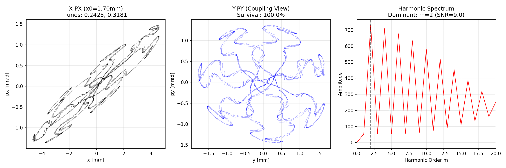
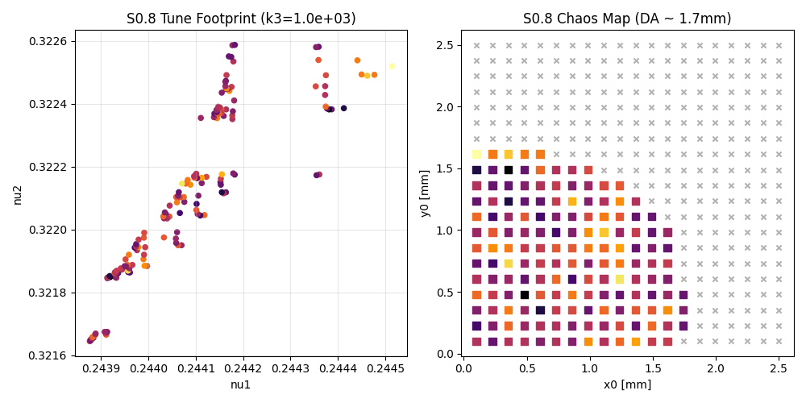
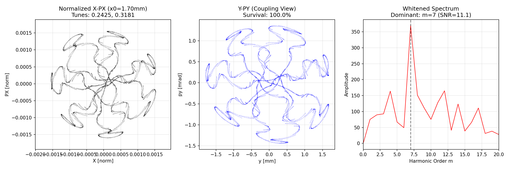
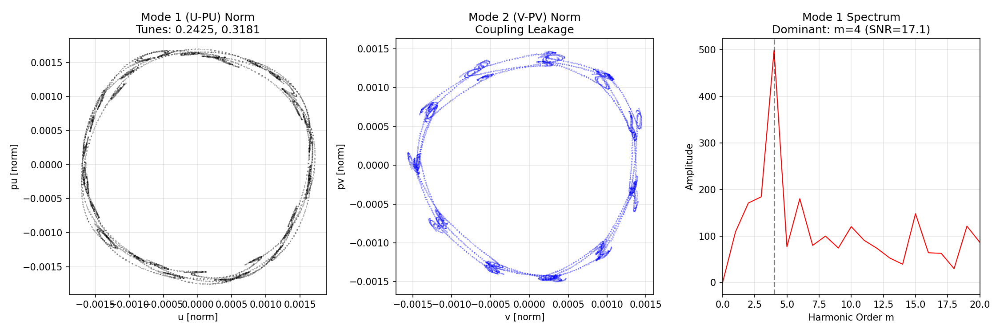

# ISOMORPH - Symplectic Particle Accelerator Dynamics Simulation

> **Status: Development & Testing Phase**
> This project is currently under active development. APIs and features may change without notice.

## Overview

**ISOMORPH** is a scientific software suite for simulating and analyzing **nonlinear beam dynamics** in particle accelerators using advanced mathematical techniques from Hamiltonian mechanics, Lie algebra, and normal form theory.

The project implements a complete computational pipeline for:
1. **Symplectic tracking** of particles through magnetic lattice elements
2. **Truncated Power Series Algebra (TPSA)** for automatic differentiation
3. **Lie algebraic methods** for Hamiltonian map factorization
4. **Baker-Campbell-Hausdorff (BCH)** formula for map compilation
5. **Normal form analysis** for extracting nonlinear dynamics invariants
6. **Resonance driving term (RDT)** computation
7. **Dynamic aperture** and chaos indicators via tune diffusion

---

## Scientific Background

### 1. Symplectic Geometry in Accelerator Physics

Particle motion in a circular accelerator is governed by Hamilton's equations. The 6D phase space coordinates are:

```
z = (x, px, y, py, z, delta)
```

where:
- `(x, px)`: horizontal position and momentum
- `(y, py)`: vertical position and momentum
- `(z, delta)`: longitudinal position and relative momentum deviation

The evolution is described by a **symplectic map** M satisfying:

```
M^T J M = J
```

where J is the standard symplectic matrix (block-diagonal with 2x2 blocks [[0,1],[-1,0]]).

### 2. Truncated Power Series Algebra (TPSA)

TPSA enables **exact computation of Taylor maps** to arbitrary order. Each phase space variable becomes a polynomial:

```
f(z) = sum_{|alpha| <= N} c_alpha * z^alpha
```

Operations (+, -, *, composition) propagate coefficients automatically, providing:
- **Transfer maps** through magnetic elements
- **Jacobians** at any phase space point
- **Higher-order aberrations** and chromaticity

### 3. Lie Algebraic Methods

The one-turn map is factorized using **Lie operators**:

```
M = exp(:F_1:) exp(:F_2:) ... exp(:F_n:)
```

where `:F:` denotes the **Lie operator** associated with Hamiltonian generator F:

```
:F: g = {g, F} = Poisson bracket
```

The exponential is computed via the series:

```
exp(:F:) g = g + {g,F} + (1/2!){​{g,F},F} + ...
```

### 4. Baker-Campbell-Hausdorff (BCH) Formula

Multiple Lie factors can be combined into a single generator using BCH:

```
exp(:A:) exp(:B:) = exp(:C:)
```

where C is computed via nested commutators:

```
C = A + B + (1/2)[A,B] + (1/12)[A,[A,B]] + (1/12)[B,[B,A]] - ...
```

This enables **map compilation** - converting element-by-element tracking into a single polynomial transformation.

### 5. Normal Form Theory

Given a one-turn map M, normal form theory seeks a **near-identity transformation** A such that:

```
A^{-1} M A = R + (resonant terms only)
```

where R is a pure rotation (linear dynamics). The transformation removes all **non-resonant** terms, leaving:

- **Detuning coefficients**: Amplitude-dependent tune shifts
- **Resonance Driving Terms (RDTs)**: Coupling and nonlinear resonance strengths

The normal coordinates are action-angle variables `(J_i, phi_i)` where:

```
nu_i(J) = nu_i0 + sum_j (dnu_i/dJ_j) * J_j
```

### 6. Wormhole Topology (Conceptual Extension)

The `isomorph_wormhole.py` module implements a **conceptual network routing model** using gravitational physics metaphors:

- **Kerr nodes**: Simulated massive/spinning objects creating "spacetime curvature"
- **Frame dragging**: Rotational effects from spinning nodes
- **Quantum tunneling**: Dynamic topology changes when "stress" exceeds threshold

This is a **visualization/educational model**, not actual physics simulation.

---

## Module Descriptions

### Core TPSA & Tracking

| File | Description |
|------|-------------|
| `tpsa_tracker.py` | TPSA class implementation with 6D element maps (drift, quadrupole, sextupole, RF cavity) |
| `lie_tpsa_tracker.py` | Lie algebraic formulation: Poisson brackets, exp(:F:) operator, Lie generators |
| `bch_tpsa_tracker.py` | BCH formula implementation (4th order), map compilation via fold strategies |
| `symplectic_tracker.py` | Numerical tracking engine with multipole kicks, RF cavities, aperture limits |

### Normal Form Analysis

| File | Description |
|------|-------------|
| `s0_2_coupled_normal_form.py` | 4D coupled linear normal form, eigenvalue normalization, homological equation solver |
| `normal_form_tracker.py` | 6D normal form via numerical tracking + FFT tune estimation |
| `s0_3_preset_verification.py` | Integration test: preset lattice through full normal form pipeline |

### Specialized Tools

| File | Description |
|------|-------------|
| `unstable_preset.py` | Dynamic aperture scanner with NAFF-style tune diffusion analysis |
| `isomorph_wormhole.py` | Educational visualization of network routing with physics metaphors |

---

## Mathematical Elements Implemented

### Magnetic Elements (Thin-Lens Approximation)

1. **Drift**: Free propagation
   ```
   x' = x + L*px/(1+delta)
   y' = y + L*py/(1+delta)
   ```

2. **Quadrupole Kick**: Linear focusing
   ```
   px' = px - k1*x
   py' = py + k1*y
   ```

3. **Sextupole Kick**: Nonlinear chromatic correction
   ```
   px' = px - (k2/2)(x^2 - y^2)
   py' = py + k2*x*y
   ```

4. **Skew Quadrupole**: Coupling element
   ```
   px' = px - ks*y
   py' = py - ks*x
   ```

5. **RF Cavity**: Longitudinal focusing
   ```
   delta' = delta + V*sin(phi0 + k_rf*z)
   ```

---

## Usage Examples

### Run BCH Compilation Test
```bash
python bch_tpsa_tracker.py
```

### Run Normal Form Analysis
```bash
python normal_form_tracker.py
```

### Run Dynamic Aperture Scan
```bash
python unstable_preset.py
```

### Run Coupled Normal Form (4D Symbolic)
```bash
python s0_2_coupled_normal_form.py
```

---

## Output Diagnostics

The software computes and reports:

1. **Symplectic Error**: Deviation from M^T J M = J (should be < 1e-10 for exact maps)
2. **Tunes**: Fractional oscillation frequencies nu_x, nu_y, nu_s
3. **Detuning Coefficients**: dnu/dJ matrix (amplitude-dependent tune shifts)
4. **Resonance Driving Terms**: Non-zero coefficients at resonant frequencies
5. **Dynamic Aperture**: Maximum stable amplitude before particle loss
6. **Tune Diffusion**: Chaos indicator via NAFF algorithm

---

## Installation

```bash
pip install -r requirements.txt
```

**Requirements:**
- Python 3.10+
- NumPy >= 1.21.0
- SymPy >= 1.10.0
- Matplotlib >= 3.5.0

---

## Theoretical References

1. **Dragt, A.J.** - "Lie Methods for Nonlinear Dynamics with Applications to Accelerator Physics"
2. **Forest, E.** - "Beam Dynamics: A New Attitude and Framework"
3. **Bengtsson, J.** - "The Sextupole Scheme for the Swiss Light Source"
4. **Laskar, J.** - "Frequency Analysis for Multi-dimensional Systems" (NAFF method)

---

## 7. Results Showcase (Chaotic Edge S0.11)
We successfully stabilized a chaotic edge regime using an octupole sculptor ($k_3 = -10^4$).

**High-Res Poincaré Plot (x=1.70mm):**
The visualization below shows the **last stable island chain** trapped just before the chaotic cliff. The particle survives 50,000 turns with zero diffusion, protected by the resonance island, while particles at 1.80mm are lost immediately.



**Resonance Atlas (Tune Footprint):**
The frequency map analysis shows the extensive tune shift driven by the sextupoles and "sculpted" by the octupoles to maintain dynamic aperture.



---

## Contributing

This project is in active development. Contributions, bug reports, and feature requests are welcome via GitHub Issues.

---

## Resonance Forensics (S1.0 - S1.2)

We successfully "reverse engineered" the underlying chaotic structure of the "Chaotic Edge" preset ($k_3 = -10^4$) by peeling away layers of phase space distortion.

### 1. Raw Data (S1.0)
Initially, the Fourier fingerprint of the Poincaré section at $x=1.70$ mm showed a dominant $m=2$ signal. This was an artifact caused by the strong linear tilt ($\alpha_x$) and ellipticity of the beam.


### 2. Linear Whitening (S1.1)
After normalizing the coordinates $(x, p_x) \to (X, P_X)$ using Twiss parameters, the $m=2$ signal vanished, revealing a dominant **m=3 (Triangle)** structure. This indicated that the geometric deformation from the strong sextupoles ($k_2=10$) was masking the resonance.


### 3. Symplectic Normal Form (S1.2)
Finally, by applying a full 4D Symplectic Normal Form transformation (eigen-decomposition of the one-turn matrix), we decoupled the $x-y$ motion. The true skeleton of the instability was revealed: the **4th Order Resonance ($m=4$)**, confirming that the island chain driving the chaos is indeed $4\nu_x = 1$.


***

## License

Licensed under the Apache License, Version 2.0. See [LICENSE](LICENSE) for details.

---

## Author

**Daniele Cangi**
GitHub: [https://github.com/Daniele-Cangi/Isomorph](https://github.com/Daniele-Cangi/Isomorph)
